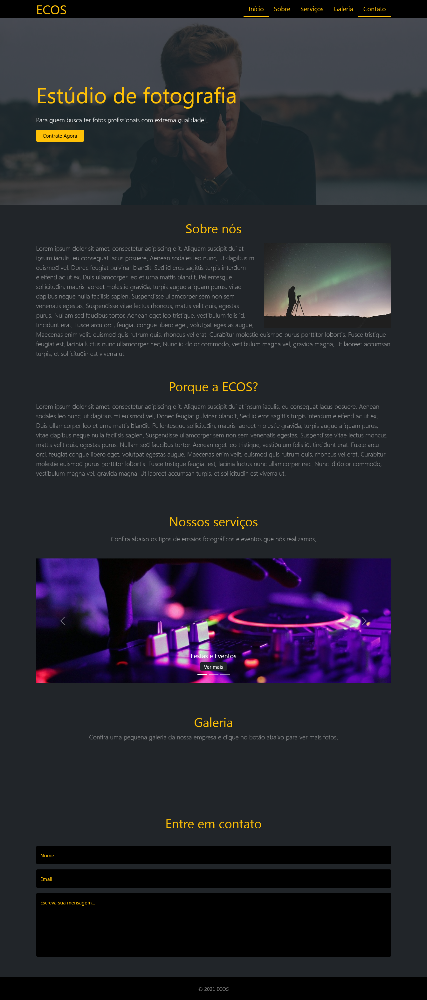

<h1 align="center">Ecos</h1>

Landing page de um estúdio de fotografia

Sumário
===========
<!--ts-->
  * [Sobre](#sobre)
  * [Screenshot](#screenshot)
  * [Como usar](#como-usar)
  * [Status](#status)
  * [Tecnologias](#tecnologias)
  * [Autor](#autor)
<!--te-->

Sobre
-----

Esse projeto foi a primeira vez em que eu usei um freamework css, inicialmente o projeto estava sendo construído com tailwindcss mas durante o desenvolvimento resolvi trocar pelo bootstrap por causa de problemas com o webpack e pelo bootstrap já ter alguns componentes com javascript prontos.

Screenshot
----------

Como Usar
---------

Você pode acessar o site clicando <a href="https://ecos-landing-page.vercel.app/">aqui</a> ou clonando este repositório.

Caso você opte por clonar o repositório, instale as dependências necessárias com o comando "npm i" ou "npm install" e depois use o comando "npm start" para abrir o projeto através do webpack dev server na porta 9000.

Status
------
Concluído :heavy_check_mark:

Tecnologias
-----------

  
  
  
  

Autor
------
<h3 align="center">Rafael Tavares</h3>

 <a href="https://www.facebook.com/rafael.tavares.39904/"></img></a>
 <a href="https://www.instagram.com/rafatavares03/"></img></a>
 

